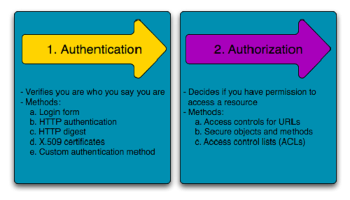

= FAQ
:toc: macro

Lista de preguntas que en algún momento se me ocurrió investigar o que por algún motivo termine buscando.

toc::[]
=== ¿Diferencia entre argumentos y parámetros? +

- Cuando hablamos de parámetros nos referimos a los cuales fueron definidos en la firma de nuestro procedimiento/función/método.
- Cuando hablamos de argumentos nos referimos a los cuales fueron definidos al invocar nuestro procedimiento/función/método.

=== ¿Que es la complejidad de un algoritmo? +

Cuando hablamos de complejidad podemos verlo desde dos focos distintos.

- Time Complexity: Complejidad temporal se refiere a como se comporta comporta nuestro algoritmo en relación al tamaño de su input.
Para indicar la complejidad espacial se utiliza la letra "theta" Θ. Por ejemplo si queremos indicar que la complejidad es lineal Θ(n)
- Space Complexity: Complejidad espacial se refiere a cuando espacio adicional en relación al input nuestro algoritmo necesita.

En algunos casos es difícil poder calcular la complejidad de un algoritmo de forma exacta por lo cual se establece un limite que nuestro
algoritmo nunca traspasará, es limite es llamado "Big O notation", y se utiliza la letra O. Por ejemplo si queremos indicar que el limite es O(n^2).

[options="header"]
|=======
|Crecimiento |Complejidad |Ejemplo
|1 |Constante |x = y + 1;
|log(n) |Logarítmica| while(n>1){ +
                      n=n/2; +
                      }
|n |Lineal| for(i=0; i<n; i=i+1){ +
                x = x + 1 +
}
|n * log(n) |Lineal + Logarítmica| Mergesort, Quicksort, …
|n^2 |Cuadrática| for(i=0; i<n; i=i+1){ +
                    for(j=0; j<n; j=j+1){ +
                      x = x + 1; +
                    } +
                  }
|n^3 |Cubica|for(i=0; i<n; i=i+1){ +
                for(j=0; j<n; j=j+1){ +
                    for(z=0; z<n; z=z+1){ +
                        x = x + 1; +
                        } +
                    } +
                }
|2^n |Exponencial|
|=======

image::images/complejidades.png[]

link:http://discrete.gr/complexity/?es[Análisis de Complejidad de Algoritmos]

=== ¿Que significa que un algoritmo de ordenamiento sea estable? +

Un ordenamiento estable es aquel que preserva el orden original de los elementos del input, cuando dos elementos nos pueden ser diferenciados.
Si consideramos un algoritmo que ordena cartas por valor, pero no por su palo. El ordenamiento estable va a garantizar que el orden original es preservado
dentro del mismo valor.

image::images/estable.png[]

=== ¿Como saber si dos intervalos se solapan? +

Debemos buscar un punto _C_ que se encuentre en ambos rangos

[source]
----
x1 <= C <= x2

y1 <= C <= y2

x1 <= y2 && y1 <= x2
----

*Nota*: Estamos asumiendo que los intervalos están definidos de forma correcta (x1 <= x2 && y1 <= y2)

=== ¿Pre-emptive vs Non-preemptive scheduling? +

* Pre-emptive: Un scheduling preemptive tiene asociado un tiempo tiempo de CPU para el proceso y puede interrumpir el mismo para darle CPU a otro con mayor prioridad.

* Non-preemptive: Un scheduling non-preemptive permite que el proceso se ejecute hasta que este termine, ceda su procesamiento o cambie a un estado de waiting por ejemplo al ejecutar IO.

[options="header"]
|=======
|Topic |Pre-emptive |Non-preemptive
|Basic |El CPU esta alocado a un proceso por un tiempo limitado |Una vez que el CPU es alocado para un proceso, este se ejecuta hasta que complete su burst time o hasta que cambie a un estado waiting
|Interrupt |El proceso puede ser interrumpido |El proceso no puede ser interrumpido hasta que termine o cambie a un estado waiting
|Starvation |Si procesos con mayor prioridad llegan de forma frecuente, los procesos con baja prioridad pueden caer en starvation |Si un proceso con un burst time grande esta siendo ejecutado entonces los otros procesos pueden caer en starvation
|Overhead |Tiene cierto overhead por el switching de tareas |No incluye overhead
|Flexibility |Es mas flexible |Es mas rigido
|=======

=== ¿Diferencia entre fail-fast y fail-safe iterators? +

La principal diferencia entre los iterators
fail-fast y fail-safe es sobre si la collection puede ser modificada mientra es iterada.
Los fail-safe permiten esto los fail-fast no.

* *fail-fast*: Este tipo de iterators actuan
sobre la collection directamente, estos fallan
tanto pronto como se detecta que la misma fue modificada (Elemento agregado, modificado o removido) y se arroja una exception del tipo ConcurrentModificationException. Algunos ejemplos son los iteradores de ArrayList, HashSet y HashMap (La gran mayoria de las collections de JDK1.4 estan implementadas de esta forma).

* *fail-safe*: Este tipo de iterators actuan
sobre una copia de la collection y por lo tanto no arrojan ningun tipo de exception. Algunos ejemplos son los iteradores de ConcurrentHashMap y CopyOnWriteArrayList.

=== ¿Diferencia entre margin y padding? +

* Margin: Es el espacio entre el borde y el exterior
* Padding: Es el espacio entre el borde y el contenido interior

=== ¿Diferencias entre autenticación y autorización? +

* *Autenticación*: Es el proceso por el cual se identifica a un usuario como válido para posteriormente acceder a ciertos recursos definidos.
* *Autorización*: Es el proceso sobre el cual se establecen que tipos de recursos están permitidos o denegados para cierto usuario o grupo de usuarios concreto.

